# System Design Curriculum: From Code to Cloud

> **How to use this document:** We're going to build TinyURL — a URL shortening service — from scratch. Each chapter introduces a real problem and teaches a system design concept as the solution. By the end, you'll understand how modern software systems work well enough to hold a conversation with any senior engineer.
>
> **No prerequisites except basic coding.** We don't assume you know anything about infrastructure, cloud, databases, or networking.

---

## Part 1: Building TinyURL

---

### Ch 1: The Code — Turning a Long URL into a Short One

**Problem:** We want to build a service that takes a long, ugly URL and returns a short, neat one. When someone visits the short one, we redirect them to the long one. To do this, we need an algorithm to generate the short code. What algorithm should we use?

**Solution Exploration:**

| Algorithm | How it works | Pros | Cons |
|---|---|---|---|
| **Random String** | Generate random characters (e.g., `x7Ks9`). | Very simple to write. | We have to check if the random string was already generated for another URL. As we get millions of URLs, checking past records takes longer and longer. |
| **Hash-based** | Run the long URL through a math function like MD5 or SHA to get a deterministic scramble. | Same URL always gives the same result. | Hashes are naturally long (32+ characters). If we chop them to be short, different URLs might end up with the same chopped hash (a collision). |
| **Counter + Base62** | Use an auto-incrementing number (1, 2, 3...) and convert it to Base62 (using a-z, A-Z, 0-9 = 62 characters). | Guaranteed unique. Numbers never repeat. Short, predictable length. | We have to keep track of the counter safely. |

**Decision:** We pick **Counter + Base62**. Reading one number and incrementing it is much faster than scanning all existing records to see if a random string was already used. We just take the next number (e.g., `10000`) and convert it to its Base62 equivalent (e.g., `2Bi`).

**When alternatives work:** Random strings are perfect for session tokens or API keys, where you can easily generate a new one if it collides, and you want them to be unguessable. Our short codes don't need to be secrets.

**Base62 Conversion Example:**
- Number 1 = `b`
- Number 10 = `k`
- Number 62 = `Ba`
- Number 10000 = `2Bi`

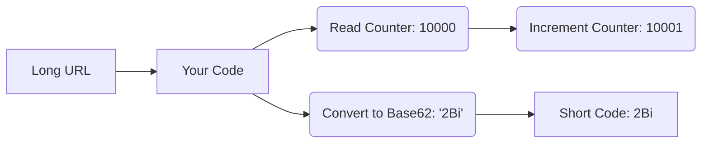

> 🤔 **Think about:** We chose a counter for TinyURL. But what if you're generating promo codes that customers shouldn't be able to guess? Would a sequential counter still work?

**What students should be able to say:** *"We use a Base62 counter for short codes because it guarantees uniqueness without having to scan past records for collisions."*

---

### Ch 2: What is the Cloud?

**Problem:** I wrote the code on my laptop. But I can't keep my laptop open forever. Every person who wants to use my service can't come to my apartment and use my laptop. Where do I run this code?

**Solution Exploration:**

| Option | How it works | Pros | Cons |
|---|---|---|---|
| **Own Data Center** | You buy servers, rent building space, pay for cooling, electricity, and network wiring. You hire people to fix broken hardware. | Complete control over the physical machines. | Massive upfront cost and time. If a machine breaks, you fix it. |
| **The Cloud** | Rent someone else's computers over the internet. They manage the buildings, electricity, and broken hardware. | Pay only for what you use. Instant setup. They handle the hard physical stuff. | You rely on another company. |

**Decision:** We pick **The Cloud**. Someone already built the data centers. We just want to rent the exact amount of computing power we need. Think of it like renting an apartment versus building a house from scratch. We will use AWS (Amazon Web Services) because it's the most popular, but these concepts apply to Google Cloud or Microsoft Azure just as well. 

**When alternatives work:** Huge companies with very specific, massive workloads (like Dropbox) sometimes move off the cloud to their own data centers to save money at an extreme scale. But for almost everyone else, the cloud is the answer.

> 🤔 **Think about:** We picked the cloud. But Dropbox famously moved OFF AWS to their own servers. What scale would justify that cost?

**What students should be able to say:** *"The cloud is just renting computing resources from someone else's data center so we don't have to buy and maintain physical servers."*

---

### Ch 3: Compute Options — Where Exactly in AWS Does Our Code Run?

**Problem:** OK, we're using AWS. But AWS has dozens of services. Where specifically do we put our code to run it?

**Solution Exploration:**

AWS gives us three main ways to run code, trading off control for convenience:

| Option | Lambda (Serverless) | Containers (ECS/Fargate) | EC2 (Full Server) |
|---|---|---|---|
| **Analogy** | Ordering food delivery — you just eat, someone else cooked and cleaned. | Meal kit delivery — ingredients arrive, you cook in your kitchen. | Buying a house with a kitchen — you buy ingredients, cook, clean, and maintain the kitchen. |
| **You manage** | Just your code. | Your code + Docker image + config. | Everything: OS, runtime, patches, scaling, uptime. |
| **Scaling** | Automatic — AWS runs more copies as traffic grows. | Semi-automatic — you configure rules. | Manual or you configure it yourself. |
| **Cost** | Pay per request (idle = free). | Pay for running containers. | Pay for uptime (even when idle). |
| **Limits** | Max 15 min runtime, limited memory. | More flexible. | Full control, no limits. |
| **Best for** | Simple functions, sporadic traffic. | Medium complexity, need more control. | Long-running heavy workloads. |

*Note on Containers:* A container is a lightweight box that packages your code plus everything it needs to run (libraries, config) so it runs the exact same way on your laptop as it does in the cloud. Docker is the tool that makes these boxes. We'll use them later, but they are a middle ground.

**Decision:** We pick **Lambda**. Our code is a simple function: put a long URL in, get a short code out. We don't want to manage servers, and traffic is sporadic at first.

**When alternatives work:** If you were building an AI image generation service that needs a massive GPU and takes 30 minutes to make one image, Lambda can't do it (15-minute limit, no GPU). You'd need an EC2 instance running all the time.


> 🤔 **Think about:** We picked Lambda. But if you were training an AI model that takes 4 hours and needs a GPU, Lambda can't do it. What would you use?

**What students should be able to say:** *"We use serverless compute like AWS Lambda so we only pay when our code runs and don't have to manage the underlying operating system."*

---

### Ch 4: How We Communicate Designs — UML Diagrams

**Problem:** Before we go further, we need a way to draw what we're building. Drawing random boxes and arrows looks messy and everyone draws differently. Is there a standard?

**Solution Exploration:**

Yes! Engineers use standard diagramming languages, often inspired by UML (Unified Modeling Language). We will use four main types of diagrams to explain our system:

1. **System Context Diagram (C4)** — The 10,000-foot view. Your entire system is just ONE box, showing who (users) or what (other systems) interacts with it.
2. **Flowchart / Architecture Diagram** — Boxes and arrows showing the internal components of our system and how data moves between them. We will use this to track our growing architecture.
3. **Sequence Diagram** — Shows interactions between components over time. Time flows top to bottom. Great for answering "what happens step-by-step when a user clicks a link?"
4. **Class/Entity Diagram** — Shows data structures and their relationships. We'll use this when designing databases.

**Decision:** We'll use a mix of Architecture and Sequence diagrams to document TinyURL, using a tool called Mermaid so we can write our diagrams as code.

From now on, every time we add a piece to our system, we'll update the architecture diagram.

> 🤔 **Think about:** Next time you read a tech blog post from Netflix or Uber, look at their diagrams. Can you identify which type (sequence, architecture, C4) they're using?

**What students should be able to say:** *"We use standard diagrams like sequence and architecture flows so other engineers can understand our system without reading the code."*

---

### Ch 5: Storage — Where Do We Keep the Data?

**Problem:** Our Lambda function runs, creates a short code, and then dies. It doesn't remember anything between runs. Where do we store the mapping between the short code and the long URL so it persists for the next person?

**Solution Exploration:**

We need a database. There are two broad categories:

| | Relational (SQL) like PostgreSQL | NoSQL like DynamoDB |
|---|---|---|
| **Structure** | Strict tables with rows and columns. Relationships via foreign keys. | Flexible key-value pairs or documents. No rigid tables. |
| **How it finds data** | Uses an **index** (like the index of a textbook) to avoid scanning every row. | **Hashes** the key to find the exact memory address instantly. |
| **Trade-offs** | Indexes make reads fast, but every new write must update the index, making writes slower. | Near-instant lookups by key, but terrible if you need to search by anything else. |
| **Language** | Uses SQL (DDL for structure, DML for data). | API calls (get item, put item). |

*Quick SQL Refresher:*
- **DDL (Data Definition Language):** `CREATE TABLE` (building the shelves).
- **DML (Data Manipulation Language):** `SELECT`, `INSERT` (putting things on shelves).
- **DCL (Data Control Language):** `GRANT` (giving out warehouse keys).

**Decision:** We pick **NoSQL (DynamoDB)**. Our data is incredibly simple: the key is `abc123` and the value is `https://example.com/long/url`. We don't need complex JOINs between tables. We just need lightning-fast lookups by short code, which DynamoDB's hashing provides perfectly.

**When alternatives work:** If you were building an e-commerce site where users have orders, orders have items, and items have reviews, you need JOINs and strict relationships. That's exactly what relational SQL databases are for.

*⚠️ Future Problem:* Our database will grow forever. Every URL ever shortened stays there. We'll handle this later.

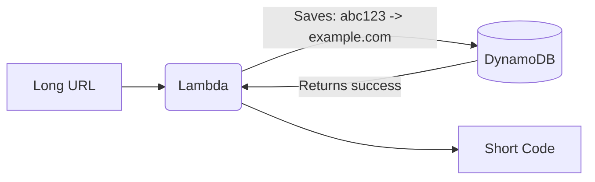

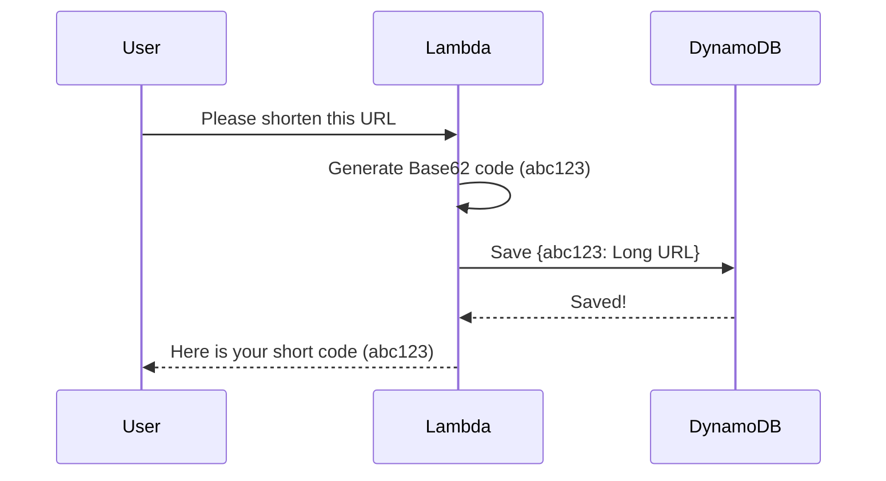

> 🤔 **Think about:** We chose DynamoDB. But what if you were building a banking app with transfers between accounts that must succeed or fail together? Would DynamoDB handle that?

**What students should be able to say:** *"We chose a NoSQL key-value store because our access pattern is a simple, direct lookup by short code, and we don't need complex relational joins."*

---

### Ch 6: APIs & HTTP — How Does the Outside World Talk to Our System?

**Problem:** We have a Lambda function and a database. But how does a user actually use this? They can't log into AWS and run our code manually.

**Solution Exploration:**

Lambda has a raw internal URL, but it requires AWS credentials. We need a clean, public front door. We'll use **API Gateway**, which creates a URL anyone can hit (like `https://abc123.execute-api.us-east-1.amazonaws.com/shorten`).

An **API (Application Programming Interface)** is a contract. Like a restaurant menu: you pick an item, tell the waiter, and get your food. The language the internet uses to talk to APIs is **HTTP**.

**HTTP Methods (Verbs):**

| Method | Purpose | TinyURL Example | Idempotent? |
|---|---|---|---|
| **GET** | Retrieve data | `GET /abc123` (redirect to long URL) | Yes |
| **POST** | Create something new | `POST /shorten` with `{url: "..."}` | No |
| **PUT** | Replace entirely | Not used in TinyURL | Yes |
| **PATCH** | Partially update | Not used in TinyURL | No |
| **DELETE** | Remove | `DELETE /abc123` | Yes |

*Idempotency:* Doing something twice has the same effect as doing it once. GETting a URL twice changes nothing. POSTing twice creates two short URLs.

**HTTP Status Codes:**
- `200 OK`: Success!
- `301 Moved Permanently`: Used for redirects. When a user asks for `GET /abc123`, we return 301 and the long URL. The browser automatically navigates there.
- `400 Bad Request`: User sent a bad URL format.
- `404 Not Found`: Short code doesn't exist.
- `500 Internal Server Error`: Our code crashed.

*What is REST?* REST is a style for designing APIs. Use the right verbs (GET to read, POST to create), make endpoints logical (`/urls/abc123`), and keep the server stateless (it doesn't remember previous requests). 

*HTTP vs HTTPS:* HTTPS encrypts the data so nobody snooping on the network can read it. Always use HTTPS. API Gateway does this automatically.

**Decision:** We will put API Gateway in front of our Lambda.

*Seed for later:* Notice that URL (`abc123.execute-api...`) is really ugly. We want `tinyurl.com`. We'll fix that later when we talk about DNS.

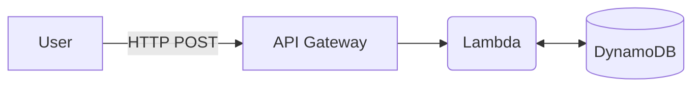

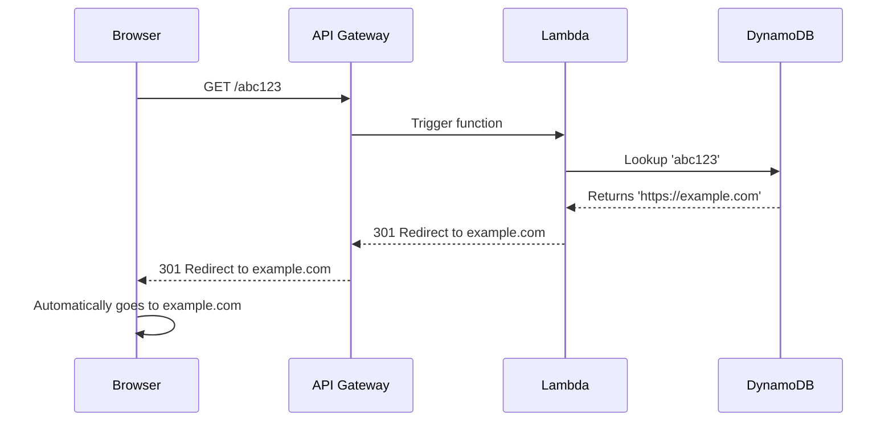

> 🤔 **Think about:** Our POST /shorten creates a new short URL every time. Should posting the same long URL twice return the same short code, or a different one? What are the trade-offs?

**What students should be able to say:** *"We expose our system through a REST API using HTTP methods, where POST creates new short links and GET retrieves them."*

---

### Ch 7: Infrastructure as Code — What If Someone Deletes Our System?

**Problem:** We set up our Lambda, DynamoDB table, and API Gateway by clicking around in the AWS console. What if a teammate accidentally deletes the production database? What if we hire a new developer and they need their own copy of the system to test on? Do they click through 50 screens too?

**Solution Exploration:**

Clicking around is bad because it's not repeatable, reviewable, or version-controlled.

| Method | Pros | Cons |
|---|---|---|
| **Manual (Console Clicking)** | Easy to start. Good for exploring. | Impossible to perfectly replicate. Prone to human error. |
| **Infrastructure as Code (IaC)** | Write a script that describes the infrastructure. Run it, and AWS builds it. | Requires learning a new syntax or tool. |

**Decision:** We will use **Infrastructure as Code (IaC)**. Tools like **Terraform**, **AWS SAM**, or **AWS CDK** let us write a file that says "Create a Lambda, a DynamoDB table, and an API Gateway."

Benefits:
- **Version Controlled:** Just like code, we commit it to git. We know who changed what.
- **Repeatable:** Run the script, get an identical stack.
- **Developer Environments:** A new developer runs the script and gets their own isolated playground stack to test safely.

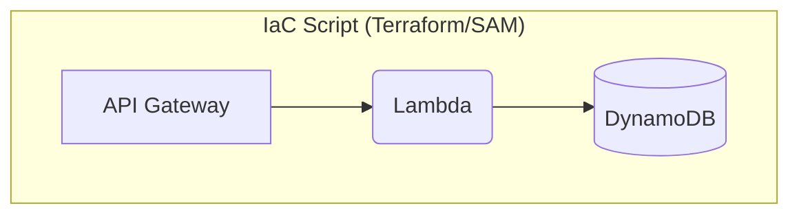

**When alternatives work:** If you are just doing a 5-minute prototype to see if a cloud service even does what you want, click around in the console. Once you decide to keep it, write the IaC.

> 🤔 **Think about:** Every new developer gets their own stack from the same IaC script. What happens when Developer A changes the script and Developer B's stack is now outdated?

**What students should be able to say:** *"We use Infrastructure as Code so our deployments are repeatable, version-controlled, and easy to spin up for new developers."*

---

### Ch 8: CI/CD Basics — How Do Changes Get to Production?

**Problem:** We have infrastructure as code. But when a developer changes the Lambda function code on their laptop, how does it safely get to the real live website? Do they manually upload it?

**Solution Exploration:**

We use an automated pipeline.
- **Continuous Integration (CI):** Every time code is pushed to git, automated tests run. If they pass, the code is safe to merge.
- **Continuous Deployment (CD):** After tests pass, a robot automatically deploys the code to our environments.

Environments:
1. **Dev:** Developer's personal playground.
2. **Beta/Staging:** A shared test environment that looks exactly like production. We test here before releasing.
3. **Production (Prod):** Real users, real data.

**Decision:** We set up a CI/CD pipeline (e.g., GitHub Actions). When a developer merges code, it builds the package, runs tests, deploys to Staging, and if everything looks good, deploys to Prod. No humans manually uploading files.

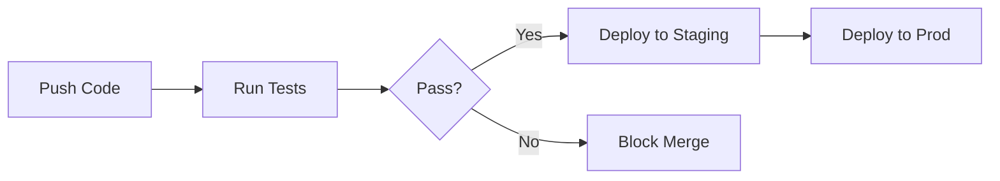

**When alternatives work:** Never. You should always have some form of automated deployment, even for personal projects.

> 🤔 **Think about:** What if your tests take 45 minutes to run and developers merge 20 PRs a day? How does slow CI affect your team's velocity?

**What students should be able to say:** *"We use a CI/CD pipeline to automate testing and safely deploy code through staging environments before hitting production."*

---

### Ch 9: Vertical Scaling — Our System is Getting Slow

**Problem:** We launched and people are using it! But we're getting slow. Our Lambda sometimes takes 3 seconds instead of 200ms. What's happening?

**Solution Exploration:**

Before scaling, understand what makes a computer fast:
- **CPU:** The brain doing calculations.
- **RAM:** Short-term memory for active work.
- **Disk:** Long-term memory. Slower than RAM.

**Vertical Scaling (Scaling Up):** Making the machine bigger. More CPU, more RAM. Like trading in your sedan for a big truck.
- For Lambda: We can increase the memory allocation, which automatically gives it more CPU power.
- For DynamoDB: We turn up the read/write capacity dial.

**The Limits of Vertical Scaling:**
- There is a maximum size for computers.
- It's a single point of failure. If the big truck breaks, everything stops.
- It gets exponentially expensive.

**Lambda's Bottleneck: Concurrency**
Lambda doesn't run on "one big machine." It runs a separate tiny instance for each request. The bottleneck is how many can run at exactly the same time (concurrency). AWS limits this to 1,000 by default. If 1,001 requests come in, one gets rejected or throttled.

*Processes vs Threads:*
Each Lambda is an isolated **process** with its own memory. They can't see each other. If two Lambdas try to read our Base62 counter at the exact same millisecond, they might both read `42` and create duplicate short codes. This is a **race condition**. We solve this by using DynamoDB's atomic increment feature, which safely updates the counter in one secure step.

**Decision:** We'll do some vertical scaling (crank up Lambda memory and DynamoDB capacity) because it requires zero code changes.

**When alternatives work:** Vertical scaling is always step 1. But when you hit the ceiling or it gets too expensive, you must change your architecture.

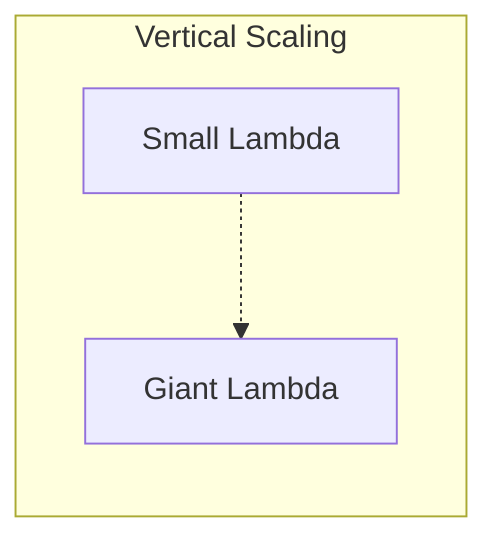

> 🤔 **Think about:** At 1,000 concurrent Lambda invocations, each opens its own database connection. Is 1,000 simultaneous database connections a problem? What could you do about it?

**What students should be able to say:** *"Vertical scaling means adding more power to an existing machine, which is easy but eventually hits a hard hardware limit."*

---

### Ch 10: Horizontal Scaling & Load Balancing

**Problem:** Vertical scaling helped, but we have a new issue. We create a short URL once, but it gets retrieved millions of times. Our single database handling all those reads is maxed out, even on the biggest setting.

**Solution Exploration:**

**Horizontal Scaling (Scaling Out):** Adding more machines instead of making one machine bigger. Like hiring 10 sedans instead for delivery instead of buying one massive truck.

For our database, we can create **Read Replicas**. The primary database handles writes (creating URLs). It copies data to replicas, which only handle reads.

| | Vertical Scaling | Horizontal Scaling |
|---|---|---|
| **What** | Bigger machine | More machines |
| **Pros** | Simple, no code changes | Near-infinite ceiling, fault-tolerant |
| **Cons** | Hard limits, single point of failure | Complex networking, data syncing issues |

**Load Balancing:** If we have 5 machines, who decides which machine gets the user's request? A **Load Balancer**.
- *Algorithms:*
  - **Round Robin:** A, then B, then C, then A...
  - **Least Connections:** Send to whoever is least busy.
  - **IP Hash:** Ensure a specific user always goes to the same server.

**Decision:** Because TinyURL is very read-heavy, we will use read replicas for DynamoDB. AWS handles the load balancing for Lambda and DynamoDB automatically, but if we were using raw servers, we would put an Application Load Balancer in front of them.

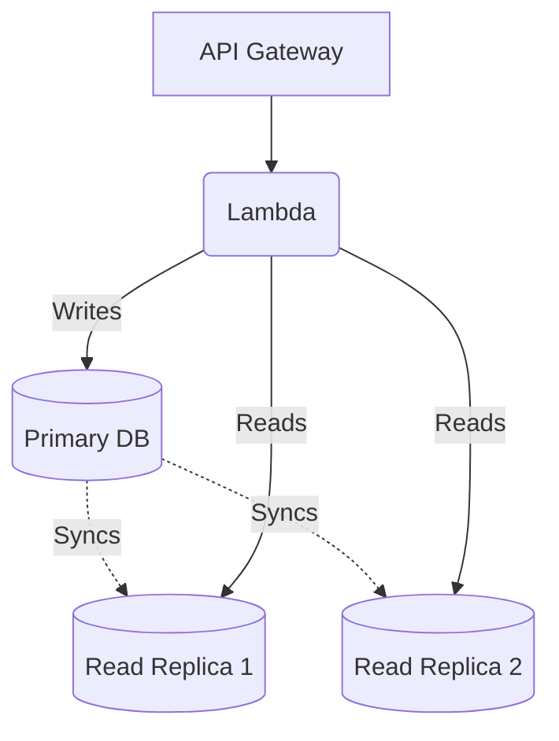

**When alternatives work:** If you have a system with huge, complex computations that can't be easily split across machines (like rendering a massive 3D scene), you might be forced to vertically scale as far as possible.

> 🤔 **Think about:** TinyURL is read-heavy. But Uber during rush hour has drivers constantly updating their locations (write-heavy). Would read replicas help Uber the same way?

**What students should be able to say:** *"We use horizontal scaling by adding read replicas to handle massive read traffic without hitting hardware limits."*

---

### Ch 11: Going Global — DNS, CDNs & Proxies

**Problem:** We have users in Europe, but our servers are in the US. Europeans experience latency just from the physical distance. Also, our URL is still an ugly AWS auto-generated string. How do we get `tinyurl.com` and make it fast globally?

**Solution Exploration:**

**DNS (Domain Name System):** The internet's phone book.
- Computers use IP addresses (like `54.210.167.23`). 
- DNS translates human names (`tinyurl.com`) to IPs.
- Like saving a contact in your phone: you tap "Mom", it dials her number.

**Geo-Routing:**
We can deploy our whole system in the US, Europe, and Asia. Using AWS Route 53 (AWS's DNS), we can do magic: when someone in Paris asks for the IP of `tinyurl.com`, Route 53 gives them the European system's IP. A user in New York gets the US IP. The user just types the URL, and DNS routes them locally!

**Proxies:**
- **Reverse Proxy:** Sits in front of our servers. The client thinks the proxy IS the server. API Gateway is a reverse proxy. It handles security and routing for us.
- **Forward Proxy:** Sits in front of the client (like a VPN).

*(Note on CDNs: A Content Delivery Network caches static files like images near users. We just return text API responses, so we don't strictly need one yet).*

**Decision:** We deploy stacks in multiple regions and use Route 53 Geo-Routing to connect users to their closest stack via `tinyurl.com`.

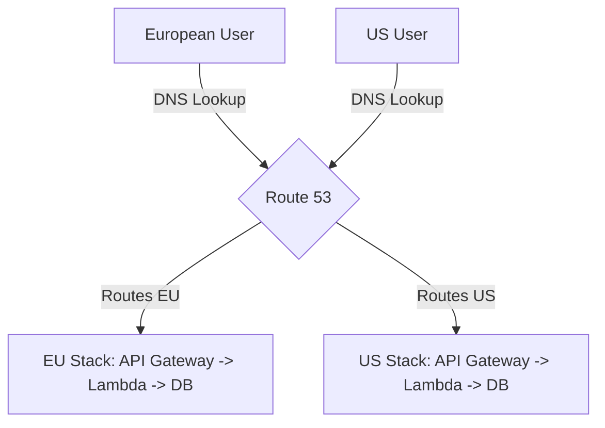

**When alternatives work:** If you only serve local businesses in one city, deploying globally is a waste of money. Stick to one region.

> 🤔 **Think about:** A user sets up a VPN to the US but is physically in Japan. Route 53 sees a US IP. Which stack serves them? Is this a problem?

**What students should be able to say:** *"We use DNS geo-routing to direct users to the physical server closest to them, reducing latency."*

---

### Ch 12: Database Scaling — Sharding, Partitioning & Archiving

**Problem:** Our database never deletes anything. The primary write database is getting massive and expensive. 

**Solution Exploration:**

When a single database gets too big, we split it up.

**Partitioning & Sharding:**
- **Partitioning:** Splitting a table into smaller chunks inside the *same* database server.
- **Sharding:** Splitting data across *multiple different* database servers. Server A holds URLs starting with A-M, Server B holds N-Z.
  - *Shard Key:* How we decide where data goes. `hash(short_code) % 4` picks one of 4 shards.
  - *Consistent Hashing:* A math trick so that if we add a 5th server, we don't have to reshuffle all the data, just a little bit of it.

*The Pain of Sharding:* Asking a question that requires searching across multiple shards is terribly slow. Avoid sharding until you must.

**Archiving (Two-Tier Storage):**
Most short links are clicked a lot in the first week, then never again. Why keep dead links in our expensive, fast database?
- **Hot Tier:** DynamoDB (fast, expensive).
- **Cold Tier:** Amazon S3 (slow, incredibly cheap).
We can write a script to move URLs that haven't been clicked in 90 days to S3. If someone clicks it a year later, it takes an extra half-second to load from S3.

*Counter Collision Fix:* Since we have US, EU, and Asia stacks, how do we stop them from using the same counter number? Give them different math: US gets numbers where `n % 3 = 0` (3, 6, 9), EU gets `n % 3 = 1` (1, 4, 7), Asia gets `n % 3 = 2` (2, 5, 8).

**Decision:** We will use two-tier archiving to save money, keeping active URLs in DynamoDB and moving old ones to S3. DynamoDB handles sharding for us under the hood using consistent hashing.

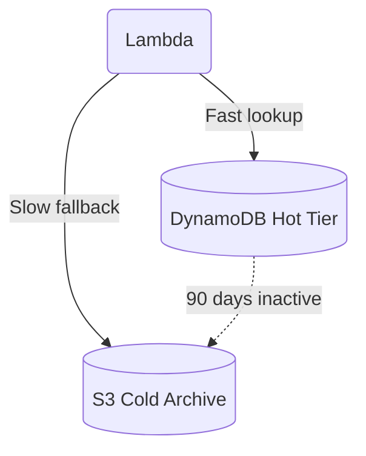

**When alternatives work:** If your data is small or naturally deletes itself (like ephemeral chat messages), you never need to shard or archive.

> 🤔 **Think about:** WhatsApp stores billions of messages. How would you shard the messages table — by user ID, by date, or by conversation ID? Each choice has very different trade-offs.

**What students should be able to say:** *"To manage infinite data growth, we archive stale data to cheap cold storage and rely on database sharding to distribute active data across multiple servers."*

---

### Ch 13: Caching — Stop Hitting the Database for the Same Thing

**Problem:** The top 1% of viral short links account for 80% of our traffic. We are hitting the database millions of times to look up the exact same URL. 

**Solution Exploration:**

**Caching:** Storing a copy of data in a faster place. Like memorizing your mom's phone number instead of checking your contacts every time. 

We can use **Redis**, an in-memory data store. It keeps data in RAM, which is 100x faster than reading from a hard disk.

**Caching Strategies:**

| Strategy | How it works | Pros | Cons |
|---|---|---|---|
| **Cache-Aside** | Lambda asks Redis. If missing, ask DB, save to Redis, return. | Only caches what's actually used. | The very first request is slow. |
| **Write-Through** | Every write goes to DB AND Redis instantly. | Data is always fresh in cache. | Slower writes. Caches junk nobody reads. |
| **Write-Behind** | Write to Redis quickly, Redis slowly syncs to DB later. | Extremely fast writes. | If Redis crashes before syncing, data is lost. |

**TTL (Time-To-Live):** We don't want Redis to fill up forever. We set a TTL of 1 hour. After an hour, the cached link vanishes. The next request will just fetch it from the DB again.

*Cache Invalidation:* The hardest problem in computer science. If data changes in the DB, the cache is now lying to users. Luckily, our short links never change their destination! 

**Decision:** We will use a **Cache-Aside** strategy with Redis. We only cache viral links that are actually being requested.

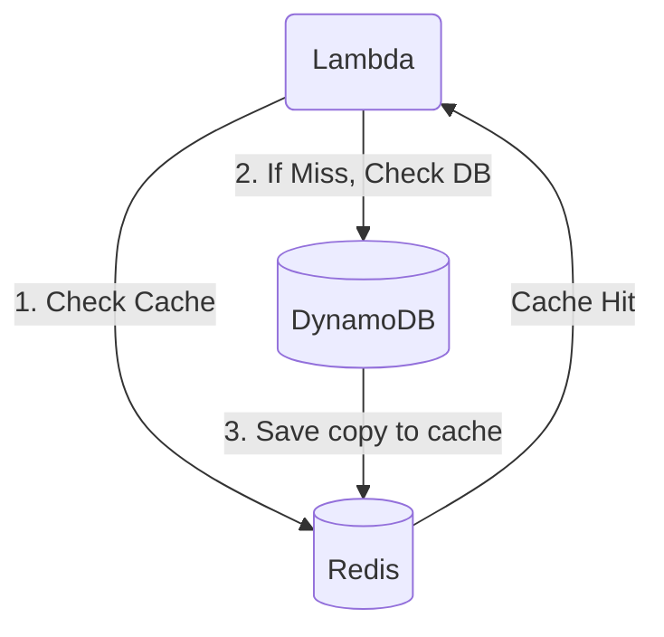

**When alternatives work:** Write-through is great for banking systems where you absolutely cannot afford for the cache to have stale data for even a second.

> 🤔 **Think about:** Would you cache Uber driver locations? They change every few seconds. What caching strategy works when data changes faster than your TTL?

**What students should be able to say:** *"We use an in-memory cache like Redis with a Cache-Aside pattern to serve highly requested viral URLs instantly without overloading the database."*

---

### Ch 14: Async Processing & Queues — Don't Block the User

**Problem:** We want to track analytics—how many times a link was clicked, from what country. But doing a database write to save this info slows down the user's redirect. They want to get to their destination NOW.

**Solution Exploration:**

**Synchronous vs Asynchronous:**
- **Synchronous:** Calling a waiter and standing by the kitchen until the food is done. You are blocked.
- **Asynchronous:** Ordering on an app, doing other things, and getting a notification later. Non-blocking.

We can use a **Message Queue** (like AWS SQS). 
When a user clicks a link, the redirect Lambda drops a quick message in the queue ("User from France clicked abc123") and instantly redirects the user. A completely separate Analytics Lambda checks the queue later and does the slow database writes. 

**Patterns:**
- **Point-to-Point (SQS):** One message goes to one processor.
- **Pub/Sub (SNS):** One message goes to many processors (e.g., analytics AND a fraud detector).

**Dead Letter Queue (DLQ):** What if the Analytics Lambda crashes while reading a message? The message goes back to the queue. If it fails 3 times, it gets moved to a DLQ. This prevents poison messages from clogging the queue forever. We set off alarms if things land in the DLQ.

**Decision:** We'll use async processing via AWS SQS. The user gets redirected instantly, and analytics are processed in the background.

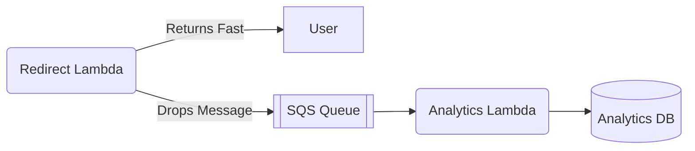

**When alternatives work:** If a user is buying an item, the payment MUST be synchronous. You can't say "Okay, we'll process your credit card in the background, hope it works!"

> 🤔 **Think about:** When you order on Amazon, you get a confirmation instantly but the warehouse ships hours later. What queue sits between the order confirmation and the warehouse?

**What students should be able to say:** *"We use message queues for asynchronous processing so we can do heavy background work like analytics without slowing down the user's request."*

---

### Ch 15: What Happens When Things Break — CAP Theorem

**Problem:** We have databases in the US and Europe. A user in NY creates `tinyurl.com/abc123`. One second later, their friend in Paris clicks it and gets a 404 Not Found error. Why?

**Solution Exploration:**

The European database hasn't received the copy from the US yet. This is **Replication Lag**. 

Databases handle this in two different ways: ACID vs BASE.

**ACID (Relational DBs):** Prioritizes strict rules. Atomicity (all or nothing), Consistency (no broken rules), Isolation (concurrent requests don't mess each other up), Durability (saved to disk).

**BASE (Many NoSQL DBs):** Basically Available, Soft state, Eventually consistent. Given enough time, all databases will catch up.

**The CAP Theorem:** In a distributed system, you can only pick TWO of three:
- **Consistency:** Every read gets the absolute latest write.
- **Availability:** Every request gets a response (even if it's slightly old).
- **Partition Tolerance:** The system survives even if the network cable between US and EU gets cut.

*Since network cuts (Partitions) WILL happen, you actually only get to choose between Consistency and Availability.*

If the network is down:
- **Choose Consistency (CP):** The EU database says, "I can't talk to the US, so I might be out of date. I refuse to answer." (Returns Error).
- **Choose Availability (AP):** The EU database says, "Here is the data I have right now, even if it might be a second old." (Returns Stale Data).

**Decision:** TinyURL chooses **Availability (AP)**. A brief 404 for a brand new cross-continent URL is acceptable. We'd rather serve an answer than crash. It will eventually be consistent a few seconds later.

**When alternatives work:** A bank uses Consistency (CP). You would much rather see an error message than see your bank account balance randomly show $0 because of stale data.

> 🤔 **Think about:** Is your bank account balance eventually consistent or strongly consistent? What about Instagram likes? How can you tell just by using the product?

**What students should be able to say:** *"Due to the CAP theorem, our distributed system prioritizes Availability over strict Consistency, meaning users might briefly see eventual consistency delays."*

---

### Ch 16: Analytics Dashboard — A New Feature

**Problem:** Product wants a dashboard showing view counts for URLs (like YouTube). We are already logging clicks async. But when we try to display them, our system melts down.

**Solution Exploration:**

*The Problem Flip:* Shortening URLs was Read-Heavy. Click tracking is Write-Heavy (every single click is a write). 

**The Race Condition:**
If two people click the link at the exact same millisecond, two Analytics Lambdas read the DB: `count = 100`. They both add one, and both save `count = 101`. We lost a click! We must use **Atomic Operations** (read+increment+save as one unbreakable step) so they queue up safely.

**Different DB for Different Problems:**
DynamoDB was great for simple key-value lookups. But analytics requires time-series data and complex aggregations ("top 10 links in France today"). 

We introduce a Document Database like **MongoDB**:
- Flexible schema.
- Built for aggregations.
- Uses a **Primary / Secondary / Arbiter** architecture. The Primary takes writes. Secondaries take reads. The Arbiter holds no data, but acts as a tie-breaking vote if the Primary dies and a new one must be elected.

Eventual consistency shines here. If the dashboard shows 1,000,000 clicks instead of 1,000,005 for a few seconds, literally nobody cares. 

**Decision:** We spin up a separate MongoDB cluster specifically for analytics. Microservices rule: use the right database for the specific job.

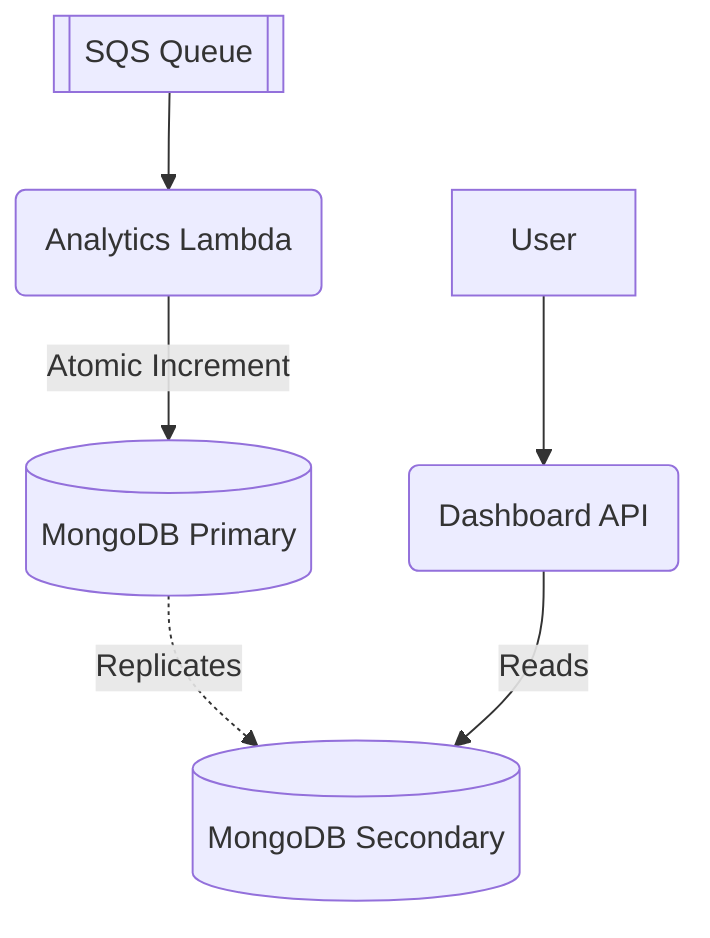

**When alternatives work:** If we were tracking exact financial ledgers instead of casual view counts, we would use a relational database with strict ACID transactions.

> 🤔 **Think about:** YouTube shows view counts with a delay. Twitter shows like counts that sometimes go up and down. Are these bugs, or is this eventual consistency in action?

**What students should be able to say:** *"We use atomic operations to prevent race conditions during write-heavy analytics tracking, and store the data in a document database optimized for aggregations."*

---

### Ch 17: User Accounts & Security

**Problem:** We want users to create accounts to manage their links and pick custom short names (like `tinyurl.com/my-brand`). How do we protect their passwords and handle conflicts?

**Solution Exploration:**

First, understand the difference between three concepts:

| | Hashing | Encryption | Encoding |
|---|---|---|---|
| **Purpose** | Verify data / Store passwords | Protect secrets | Change format |
| **Reversible?** | NO (One-way) | YES (With a key) | YES (No key needed) |
| **Example** | SHA-256 | AES | Base64 |

**Passwords:** NEVER store plain text. We hash passwords: `hash(password + salt)`. A salt is a random string added to stop hackers from using pre-calculated cheat sheets (rainbow tables). 

**Authentication Methods:**
- **Session-based:** Server remembers you via a cookie.
- **JWT (JSON Web Token):** Server signs a digital ID card. You show it every time. Server is stateless.
- **OAuth:** "Log in with Google." Let someone else do the hard work.

**Custom URL Conflicts (Mutex):**
What if two users try to claim `tinyurl.com/apple` at the exact same time? This is a race condition. We use a **Database Transaction** with a unique constraint. The database acts as a **Mutex** (Mutual Exclusion) lock. It guarantees that only one request will succeed, and the other will fail.

**Security:**
- **Rate Limiting:** API Gateway stops a user from making 10,000 requests a second (DDoS attack).
- **SSL/TLS:** The 'S' in HTTPS. It encrypts the pipe between the user and our API so nobody on Starbucks Wi-Fi can steal their data. 

**Decision:** We will add a user service using JWTs for stateless authentication, and rely on database unique constraints to safely lock custom URLs.

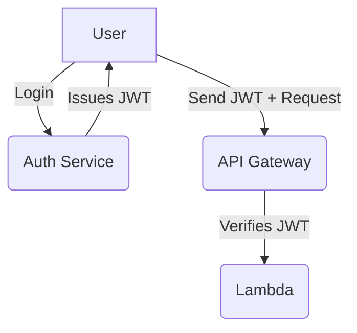

> 🤔 **Think about:** How does 'Login with Google' work on a third-party app? Does the app ever see your Google password? What's actually happening under the hood?

**What students should be able to say:** *"We use salted hashing to safely store passwords, and rely on database unique constraints as a mutex to prevent race conditions on custom URL claims."*

---

### Ch 18: Deployment at Scale

**Problem:** We have stacks in the US, Europe, and Asia. When we push a new code update, do we just blast it to the whole world instantly? What if there's a bug?

**Solution Exploration:**

Deploying everywhere at once is how you take down the whole internet. We need safer strategies.

**Deployment Waves:**
1. Deploy to US-East in the middle of the night (lowest traffic).
2. Wait 30 minutes. Monitor error rates.
3. If healthy, deploy to Europe. 
4. Monitor. Deploy to Asia. 

**Advanced Strategies:**
- **Canary Deployment:** Route 95% of traffic to the old code, and 5% to the new code (the canary in the coal mine). If the 5% errors spike, roll back instantly.
- **A/B Testing:** Show version A to 50% of users, version B to the other 50%. See which one gets more clicks. 
- **Feature Flags:** Ship the code to production, but keep it turned off via a toggle switch. Turn it on for beta testers only. If it breaks, flip the switch off. No code redeploy required.

**Decision:** We will use Canary Deployments and Feature Flags. It gives us maximum safety when pushing updates to our global system.

**The Final Architecture:**

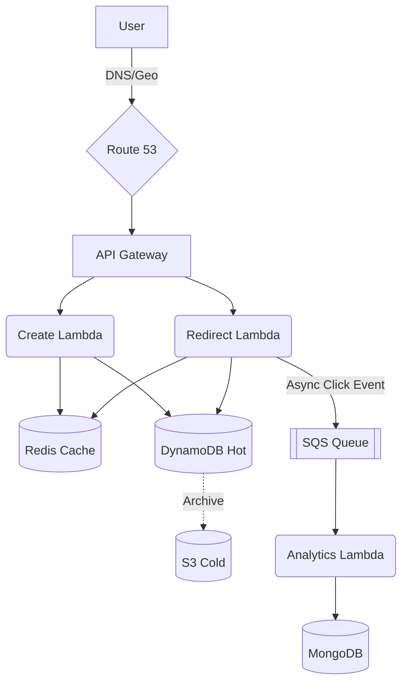

**When alternatives work:** If you are a single dev working on a weekend project, just push to prod instantly. Don't overengineer.

> 🤔 **Think about:** A/B testing shows the new UI increases watch time by 4% but decreases ad clicks by 2%. Do you ship it? Who makes that call — engineering or product?

**What students should be able to say:** *"We use canary deployments and feature flags to safely roll out changes, minimizing the impact of potential bugs on our global user base."*

---
---

## Part 2: Beyond TinyURL — Building YouTube

> We built TinyURL and learned a LOT. But TinyURL is a simple, serverless system. Many critical concepts don't show up naturally in that architecture. So let's build something bigger: **YouTube**.
>
> YouTube is a system you already use every day. You know what it does. Now let's understand HOW it does it.

---

### Ch 19: The Upload Pipeline — "Why Does It Say 'Processing'?"

**Problem:** "You upload a video to YouTube. It says 'Processing...' for 10 minutes before it's watchable. What's happening behind the scenes?"

When you upload a video, it isn't just stored exactly as you uploaded it. It's **transcoded** into multiple formats and resolutions (1080p, 720p, 480p, 360p) and multiple codecs (like H.264, VP9, or AV1) so it plays smoothly on any device, on any internet connection.

This is a MASSIVE amount of computational work. A 10-minute 4K video might take 30-45 minutes to process. This process is inherently **asynchronous** — you can't make the user wait 45 minutes keeping their browser tab open waiting for an HTTP response.

**The Pipeline:**
1. A user uploads a video, and it gets stored in object storage (like AWS S3).
2. The upload service puts a message on a queue (like SQS): "New video, ID 12345, stored at s3://videos/12345.mp4".
3. Transcoding workers pick up the message and process the video.
4. When done, the worker puts a message on another queue: "Video 12345 ready".
5. A notification service picks up that message and notifies the user that their video is live.

Remember in TinyURL, we used SQS queues for fire-and-forget analytics. Here, it's the CORE workflow! It decoupling the fast web servers from the slow video processors.

**Dead Letter Queue (DLQ):**
What if transcoding fails because the video file is corrupted or in an unsupported format? After a few retries (maybe 3), the message gets sent to a DLQ. An alert fires for an engineer, and the user sees a "Processing failed" message instead of waiting forever.

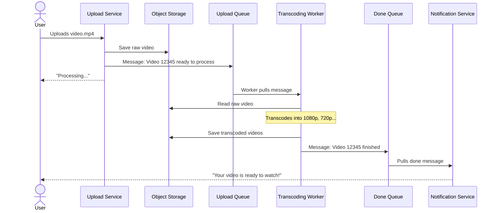

> 🤔 **Think about:** Spotify processes uploaded podcasts too — noise reduction, normalization, multi-bitrate encoding. How similar is their pipeline to YouTube's?

**What students should be able to say:** *I understand that long-running tasks like video transcoding must be decoupled from the web request using message queues to keep the system responsive.*

---

### Ch 20: Transcoding Needs Real Servers — Containers & Docker

**Problem:** "Lambda has a 15-minute time limit and limited CPU. Transcoding a 4K video takes 45 minutes and needs serious CPU power. Lambda literally cannot do this job."

In TinyURL, Lambda was perfect. It ran our code for a few milliseconds, scaled instantly, and we didn't manage any servers. But Lambda's limits force us to use something else for heavy workloads like transcoding.

| Feature | Lambda | EC2 | Containers (ECS/Fargate) |
|---|---|---|---|
| **Runtime limit** | 15 minutes | Unlimited | Unlimited |
| **CPU/GPU** | Limited, no GPU | Full control, GPU available | Full control, GPU available |
| **Scaling** | Automatic | Manual or auto-scaling groups | Automatic with orchestrator |
| **Management** | Zero (serverless) | You manage everything | You manage the Docker image, AWS manages the rest |
| **Cost** | Per request | Per hour (even idle) | Per container-second |

**Enter Docker:**
- **What is a container?** It's a lightweight, isolated environment that packages your code and ALL its dependencies (OS libraries, runtime, config files) into one portable unit.
- **Docker image:** Think of it as a blueprint or recipe. "Start with Ubuntu, install FFmpeg, install Python, copy my transcoding code, set the entry point."
- **Docker container:** A running instance of an image. It's like the difference between a class and an object in OOP.
- **Why containers over VMs?** Virtual Machines include an entire operating system, making them heavy and slow to start. Containers share the host OS kernel, so they are lightweight and start in seconds.

**AWS Container Options:**
| Service | What it is |
|---|---|
| **ECR** | Elastic Container Registry — stores your Docker images (like DockerHub but private). |
| **ECS** | Elastic Container Service — runs containers. You tell it "run 5 copies of this image." AWS manages the servers. |
| **Fargate** | Serverless containers — like ECS but you don't even see the servers. Just say "run this container with 4 CPUs." |
| **EKS** | Elastic Kubernetes Service — runs containers using Kubernetes (more on this next). |

For YouTube transcoding, we create a Docker image packed with FFmpeg (a video processing tool) and our code. We run it on ECS or Fargate with enough CPU to crush 4K video. 

The phrase "It works on my machine" is dead. The Docker image IS the machine. If it works in development, it runs identically in production.

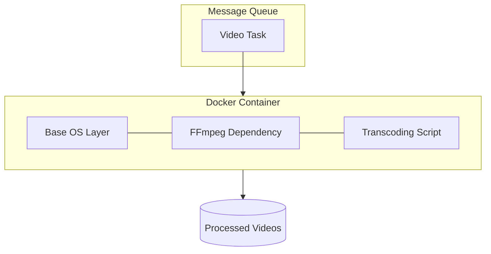

> 🤔 **Think about:** Your Docker image is 2GB and takes 10 minutes to deploy. How would you reduce the image size? (Hint: multi-stage builds, Alpine base images.)

**What students should be able to say:** *Containers package my application and all its dependencies into a single runnable unit, solving the 'works on my machine' problem and allowing long-running tasks that serverless functions can't handle.*

---

### Ch 21: Scaling Workers — Kubernetes

**Problem:** "At 3 AM, nobody uploads videos. At 6 PM on a Friday, everyone does. We're paying for 50 transcoding containers at 3 AM (all idle) and running out of capacity at 6 PM. How do we scale up and down automatically?"

In TinyURL, Lambda handled scaling invisibly. Since we're using containers on real servers now, we need a system to manage that scaling.

**Kubernetes (K8s)** is an orchestration system that manages containers at scale. It handles:
- **Scheduling:** Deciding which machine runs which container.
- **Scaling:** Adding or removing container copies based on demand.
- **Self-healing:** If a container crashes mid-transcode, K8s notices and restarts it.
- **Rolling deployments:** Gradually replacing old containers with new ones without taking the system offline.

**Key Vocabulary:**
| Term | What it is | Analogy |
|---|---|---|
| **Pod** | The smallest deployable unit — one or more containers that share storage and network | An apartment |
| **Node** | A physical or virtual machine that runs pods | An apartment building |
| **Cluster** | A group of nodes | A neighborhood |
| **Deployment** | Declares "I want 10 copies of this pod running" — K8s makes it so | A property management company ensuring occupancy |
| **HPA (Horizontal Pod Autoscaler)** | Automatically adjusts the number of pods based on CPU/memory usage | Renting more apartments during peak season |

**Auto-scaling in action:**
You set a rule in the HPA: "If average CPU across transcoding pods > 70%, add more pods. If < 30%, remove some." 
At 3 AM, you might have 2 pods running to keep costs minimal. At 6 PM on Friday, a traffic surge causes K8s to spin up 200 pods. When the rush ends, it scales back down. 

**Self-healing:** If a pod runs out of memory and crashes mid-transcode, K8s detects the crash and restarts it. The SQS message that assigned the work wasn't marked as finished, so it gets picked up again and processed successfully.

**When you DON'T need K8s:** If you are using Lambda or Fargate, AWS handles scaling for you. Kubernetes is for when you need fine-grained control over container orchestration, complex scheduling rules, or multi-cloud portability.

```mermaid
flowchart TD
    subgraph K8s Cluster
        HPA[Horizontal Pod Autoscaler<br/>Monitors CPU > 70%]
        
        subgraph Node 1
            Pod1[Worker Pod]
            Pod2[Worker Pod]
        end
        
        subgraph Node 2
            Pod3[Worker Pod]
            Pod4[Worker Pod]
        end
        
        HPA -.-> |Scales up| Node 2
    end
    
    SQS[Upload Queue] --> Pod1
    SQS --> Pod2
    SQS --> Pod3
```

> 🤔 **Think about:** AWS Fargate handles container scaling automatically — like Lambda for containers. When would you still choose the complexity of Kubernetes over Fargate?

**What students should be able to say:** *Kubernetes is an orchestration tool that automates the deployment, scaling, and self-healing of containerized applications.*

---

### Ch 22: Inside the Worker — Processes, Threads & Locks

**Problem:** "Our transcoding container processes one video at a time. But the machine has 8 CPU cores. We're only using one core. Can we transcode 8 videos simultaneously on one machine?"

**Processes vs Threads:**
| Feature | Process | Thread |
|---|---|---|
| **What** | Independent program with its own memory | Lightweight execution unit WITHIN a process, sharing its memory |
| **Memory** | Isolated — can't see other processes' data | Shared — all threads in a process see the same heap |
| **Communication** | Inter-Process Communication (IPC): pipes, sockets (slow, complex) | Direct shared memory (fast, dangerous) |
| **Crash impact** | One process crashes → others fine | One thread crashes → whole process dies |
| **Example** | Chrome tabs are separate processes | A web server handling requests in a thread pool |

**CPU-bound vs I/O-bound:**
Transcoding is **CPU-bound** (computationally heavy), whereas making an API call is **I/O-bound** (waiting on the network). For CPU-bound tasks, we benefit from true parallelism by using multiple threads, usually one per core.

We use a **Thread Pool**: Instead of spinning up a new thread for every video (which is expensive), we maintain a pool of 8 threads. Videos wait in a line, and the next available thread grabs the next video.

**The danger of shared state — Race Conditions:**
Threads share memory, which is dangerous! Imagine our worker needs to update a database record for video progress.
- Thread A finishes a 1080p transcode, reads the status as "processing", and prepares to write "1080p_done".
- At the exact same microsecond, Thread B finishes a 720p transcode, reads the status as "processing", and prepares to write "720p_done".
- Thread B overwrites Thread A's update. Thread A's work is lost from the status. This is a **race condition**.

**Locks (Mutex & Semaphores):**
- **Mutex (Mutual Exclusion):** A lock that only one thread can hold at a time. Like a bathroom door lock. Thread A locks the mutex, updates the status, and releases it. If Thread B tries to do the same, it must wait until Thread A is done.
- **Semaphore:** Like a mutex but allows N threads at a time. Like a parking lot with 4 spots.

**Deadlock:**
The nightmare scenario! Thread A holds Lock 1 and waits for Lock 2. Thread B holds Lock 2 and waits for Lock 1. Both wait forever. To prevent this, threads must always acquire locks in the exact same order.

**Concurrency vs Parallelism:**
- **Concurrency:** Managing multiple tasks by switching between them quickly (e.g., Node.js doing async I/O on a single core).
- **Parallelism:** Doing multiple tasks at the exact same physical time (e.g., 8 threads running on 8 distinct CPU cores).

```mermaid
flowchart LR
    Queue[Video Task Queue]
    
    subgraph Process [Transcoding Process]
        T1[Thread 1]
        T2[Thread 2]
        T3[Thread 3]
        T4[Thread 4]
        
        Shared[Shared DB Connection]
        Mutex((Mutex Lock))
    end
    
    Queue --> T1
    Queue --> T2
    Queue --> T3
    Queue --> T4
    
    T1 -.-> Mutex
    T2 -.-> Mutex
    Mutex --> Shared
```

> 🤔 **Think about:** Node.js is single-threaded but handles thousands of concurrent connections. How is that possible if it only has one thread? (Hint: event loop, async I/O.)

**What students should be able to say:** *Threads allow a process to perform multiple tasks in parallel on multi-core CPUs, but shared memory requires synchronization mechanisms like mutexes to prevent race conditions.*

---

### Ch 23: Millions Watching — Load Balancing in Practice

**Problem:** "A new music video drops and 10 million people click play in the same minute. One streaming server can't handle that. How do we distribute the load?"

In TinyURL, API Gateway handled load balancing invisibly for our Lambda functions. But YouTube's video streaming servers are beefy EC2 instances or containers — we need an explicit load balancer.

An **Application Load Balancer (ALB)** sits between the users and your fleet of servers. It receives every incoming request and decides which backend server should handle it. It also constantly health-checks the servers; if one goes down, the ALB stops routing traffic to it.

**Load Balancing Algorithms:**
| Algorithm | How it works | YouTube usage |
|---|---|---|
| **Round Robin** | A → B → C → A... | Simple, but ignores if Server A is currently overwhelmed. |
| **Least Connections** | Route to server with fewest active connections | Better for streaming, where connections stay open a long time. |
| **Weighted** | Server A gets 50%, Server B gets 30%... | Useful if some servers have more CPU/RAM than others. |

**Layer 4 vs Layer 7 Load Balancing:**
| Feature | Layer 4 (Transport) | Layer 7 (Application) |
|---|---|---|
| **Sees** | Only IP addresses and ports (TCP/UDP) | Full HTTP — URLs, headers, cookies |
| **Speed** | Faster | Slower (has to parse HTTP) |
| **Smart Routing** | No | Yes (route `/api/videos` here, `/api/comments` there) |
| **Example** | Network Load Balancer (NLB) | Application Load Balancer (ALB) |

**CDNs for Video Serving:**
Actually, most video isn't served by YouTube's origin servers at all. It's served from a **Content Delivery Network (CDN)**. CloudFront caches popular videos on edge servers worldwide (close to the user). The heavy streaming origin servers only get hit for a "cache miss" (when someone watches an obscure video not stored on the edge).

```mermaid
flowchart TD
    Users((Millions of Users))
    
    CDN[CDN Edge Nodes<br/>Worldwide]
    ALB[Application Load Balancer]
    
    subgraph Auto-Scaling Group
        S1[Streaming Server]
        S2[Streaming Server]
        S3[Streaming Server]
    end
    
    Users -->|Request Video| CDN
    CDN -->|Cache Hit| Users
    CDN -->|Cache Miss| ALB
    ALB --> S1
    ALB --> S2
    ALB --> S3
```

> 🤔 **Think about:** You're load balancing WebSocket connections. Round robin assigns connections at connect time, but some connections last 2 hours while others last 5 seconds. Is the load really balanced?

**What students should be able to say:** *A load balancer distributes incoming network traffic across multiple servers to ensure high availability and reliability, while CDNs handle the bulk of static content delivery.*

---

### Ch 24: Services Talking to Services — gRPC & Microservices

**Problem:** "YouTube has an upload service, transcoding service, notification service, recommendation service, comment service, analytics service. They all need to talk to each other. Do they all use REST APIs?"

YouTube isn't one giant program (a monolith); it's split into many small, independent services. This is a **Microservices Architecture**.

| Architecture | Description | Pros | Cons |
|---|---|---|---|
| **Monolith** | One codebase, one database, deployed together. | Simple to develop and test initially. | Hard to scale parts independently; one bug takes down the whole app. |
| **Microservices** | Many small services, each with its own database, talking over the network. | Independent scaling, deployment, and technology choices. | Distributed systems are complex to manage and debug. |

**Why not REST for internal communication?**
REST uses JSON. JSON is text-based, human-readable, and great for public APIs, but it's verbose and slow to parse. For millions of internal server-to-server requests per second, that overhead adds up. Plus, REST has no strict schema built-in.

**Enter gRPC:**
| Feature | REST | gRPC |
|---|---|---|
| **Data format** | JSON (text, large) | Protocol Buffers (binary, compact) |
| **Contract** | Informal | Strict `.proto` schema file |
| **Speed** | Slower | ~10x faster (HTTP/2 binary framing) |
| **Streaming** | No | Yes (client, server, and bidirectional) |
| **Best for** | Public APIs, Browsers | Internal service-to-service |

**Protocol Buffers (protobuf):**
With gRPC, you define your data structures in a `.proto` file. Both communicating services know this exact schema at compile time. This means type safety across the network!

For YouTube: The upload service sends a fast gRPC call to the transcoding service. The transcoding service streams progress updates back over gRPC. It's all internal, lightning-fast, and strongly typed.

```mermaid
flowchart LR
    Client[Mobile App]
    API[API Gateway]
    
    subgraph Microservices
        Upload[Upload Service]
        Transcode[Transcoding Service]
        Notif[Notification Service]
    end
    
    Client -- "REST (JSON)" --> API
    API -- "REST (JSON)" --> Upload
    Upload -- "gRPC (Protobuf)" --> Transcode
    Transcode -- "gRPC (Protobuf)" --> Notif
```

> 🤔 **Think about:** Why does the YouTube mobile app use REST to talk to YouTube's backend, but YouTube's internal services talk to each other with gRPC? What would happen if they used gRPC for the mobile app too?

**What students should be able to say:** *Microservices use fast, binary protocols like gRPC for strict, high-performance internal communication, while exposing user-friendly REST APIs to the public web.*

---

### Ch 25: WebSockets & Real-Time Communication

**Problem:** "YouTube Live. A streamer is broadcasting and 500,000 viewers are watching simultaneously. Also, live chat — messages must appear for all viewers in real time. How does this work? REST is request-response... the server can't push updates to the client."

**The limitation of REST:** HTTP is strictly request-response. The client asks, the server answers. If you want updates, the client has to keep asking over and over (polling). That's incredibly wasteful.

**WebSockets** upgrade a standard HTTP connection into a persistent, two-way communication channel. Once established, the server can push data to the client at any time without the client having to ask.

| Feature | REST (HTTP) | WebSockets |
|---|---|---|
| **Connection** | New connection per request | Persistent connection stays open |
| **Direction** | Client → Server → Client | Both directions, simultaneously |
| **Overhead** | HTTP headers sent on every request | Initial handshake, then lightweight frames |
| **Use case** | Standard web APIs, page loads | Live chat, gaming, real-time dashboards |

**Live Streaming & Chat:**
When 500,000 people watch a live stream, the video itself often uses adaptive streaming over HTTP chunks (like HLS or DASH), but the **live chat** uses WebSockets. 
When one person types a message, their WebSocket sends it to a chat server. The chat server immediately broadcasts that message down 500,000 other open WebSocket connections in milliseconds.

**When NOT to use WebSockets:**
If you don't need real-time data, WebSockets add unnecessary complexity (handling dropped connections, server memory limits). TinyURL didn't need them because redirecting a link is a one-shot operation.

```mermaid
sequenceDiagram
    actor Viewer
    participant Server as Live Chat Server
    
    Viewer->>Server: HTTP GET /chat (Upgrade: websocket)
    Server-->>Viewer: HTTP 101 Switching Protocols
    Note over Viewer,Server: WebSocket Connection Established
    
    Server->>Viewer: Push: "User A says hi!"
    Server->>Viewer: Push: "User B joined."
    Viewer->>Server: Send: "This stream is great!"
    Server->>Viewer: Push: "User C: Agreed!"
```

> 🤔 **Think about:** Slack shows a typing indicator when someone is typing a message. Is that REST polling or WebSockets? What about Gmail — how does it know you have new email?

**What students should be able to say:** *WebSockets provide a persistent, bidirectional connection between client and server, enabling real-time features like live chat without the overhead of HTTP polling.*

---

### Ch 26: Patterns in the Code — Design Patterns

**Problem:** "YouTube's transcoding supports H.264, H.265, VP9, and AV1 codecs. Adding a new codec means changing code in 12 different files. Every time a PM says 'support this new format,' it's a week of work. There has to be a better way to organize this."

**Design patterns** are reusable solutions to common code architecture problems.

**Factory Pattern:**
- **Problem:** You need to instantiate different objects based on configuration.
- **Solution:** An `EncoderFactory` takes a codec string ("vp9") and returns the correct class instance. If you add a new codec, you write the new class and add one line to the factory. The rest of your app doesn't change.

**Strategy Pattern:**
- **Problem:** You have multiple algorithms for the same task and want to swap them dynamically.
- **Solution:** A `RecommendationStrategy` interface with implementations like `TrendingStrategy` and `RelatedStrategy`. The system picks the strategy, and the caller code doesn't care which one is executing, as long as it returns a list of videos.

**Observer Pattern:**
- **Problem:** When an event happens, multiple independent systems need to react.
- **Solution:** When a video finishes transcoding, it emits an event. The search index, notification service, and thumbnail generator all "subscribe" to this event. The transcoding code doesn't need to know who is listening. (This is the code-level equivalent of pub/sub!).

**Singleton Pattern:**
- **Problem:** You need exactly ONE shared instance of something (like a database connection pool).
- **Solution:** The class restricts its own instantiation so only one object ever exists. Use this sparingly, as global state makes testing difficult.

**When to use patterns:** Don't force them. If adding a new feature requires changing massive `if/else` chains across your entire codebase, that's when a pattern will save you.

```mermaid
classDiagram
    class EncoderFactory {
        +getEncoder(codec)
    }
    class VideoEncoder {
        <<interface>>
        +encode(video)
    }
    class H264Encoder
    class VP9Encoder
    
    EncoderFactory ..> VideoEncoder : Creates
    VideoEncoder <|.. H264Encoder
    VideoEncoder <|.. VP9Encoder
```

> 🤔 **Think about:** You have 3 payment providers (Stripe, PayPal, Square). Which design pattern would let you swap between them without changing your business logic?

**What students should be able to say:** *Design patterns like Factory and Strategy decouple my application logic, making it easier to add new features without modifying existing, tested code.*

---

### Ch 27: Rolling It Out — Deployment Waves & A/B Testing

**Problem:** "We redesigned the YouTube video player. We can't ship it to all 2 billion users at once. What if it has a bug? What if users hate it?"

You don't just push code to production and hope for the best. You use **Deployment Waves**:
1. Deploy to 1% of users. Monitor error rates, crashes, and latency.
2. Wait 24 hours. If metrics are healthy, expand to 10%.
3. Wait again. Expand to 50%, then 100%.
If anything breaks at any stage, you roll back immediately.

**Canary Deployment:**
Named after "canaries in a coal mine", you route a tiny fraction of live traffic to the new version (the canary) while the rest hits the stable version. You compare their metrics side-by-side. If the canary's error rate spikes, you kill the canary and stop the rollout.

**A/B Testing:**
This isn't about bugs; it's about product decisions. Group A sees the old video player. Group B sees the new one. You measure engagement, watch time, and clicks. If Group B watches 4% more video, the data proves the redesign is a success.

**Feature Flags:**
Ship your code everywhere, but hide the new feature behind a configuration toggle.
Example: Adding a "3x playback speed" option. The code is deployed, but the feature flag is disabled. You can flip the flag to enable it for 5% of users without doing a new deployment. If users complain, flip it off instantly.

```mermaid
flowchart LR
    Users((Users))
    Router{Traffic Router}
    
    subgraph Stable Production
        V1[Version 1.0 <br/> 95% Traffic]
    end
    
    subgraph Canary
        V2[Version 2.0 <br/> 5% Traffic]
    end
    
    Users --> Router
    Router -->|95%| V1
    Router -->|5%| V2
```

> 🤔 **Think about:** You ship a feature flag to 100% of users and want to remove the old code path. How long do you wait before deleting it? What if you delete it too early?

**What students should be able to say:** *Techniques like canary deployments and feature flags minimize the risk of shipping new code by exposing changes to a small subset of users before a full release.*

---

### Ch 28: Not All Problems Are Equal — Complexity Classes

**Problem:** "A PM asks: 'For our curated playlists, can we find the optimal watch order that minimizes topic-switching between videos?' You write an algorithm: it takes 2 seconds for 10 videos, 2 minutes for 15 videos, and would take 3 years for 30 videos. What's going on?"

Not all problems are solvable.

**P (Polynomial Time):** Problems we can SOLVE efficiently. As input size grows, the compute time grows at a manageable rate.
- Sorting a list: O(n log n)
- DB Index Lookup: O(log n)
- Everything we've built so far is in P.

**NP (Nondeterministic Polynomial):** Problems where we can VERIFY a solution quickly, but we don't know how to FIND a solution quickly.
- The playlist problem is the **Traveling Salesman Problem (TSP)** in disguise. Finding the optimal order for 30 videos means checking 30! (30 factorial = 265 quintillion) combinations.

**NP-Hard / NP-Complete:** The hardest problems in NP. If you solve one efficiently, you solve them all (and win a million-dollar prize).

**Why this matters practically:**
If you recognize a problem is NP-Hard, you know there is no perfectly efficient exact solution. You need to stop trying to find one.
Instead, use a **heuristic** — a "good enough" approximation. Google Maps doesn't find the mathematically flawless optimal route; it uses heuristics to find a route within 5% of optimal in milliseconds. For the playlist, just pick the next video with the most similar topic (a greedy algorithm).

**The P = NP question:**
"Can every problem that's easy to verify also be solved efficiently?" Nobody knows. It is the biggest open question in computer science. If P = NP, modern encryption breaks overnight. Most computer scientists assume P ≠ NP.

(Search YouTube for "P vs NP explained" for a great visual breakdown!)

> 🤔 **Think about:** Your PM says 'just throw more servers at it' to solve a slow algorithm. Can parallelism solve an NP-Hard problem? Why or why not?

**What students should be able to say:** *Recognizing an NP-Hard problem is a vital engineering skill, as it tells me to stop looking for a perfect solution and start writing a fast heuristic approximation instead.*

---

## What's Next?

You now have the vocabulary and mental models to:
- Understand system architecture diagrams
- Discuss trade-offs in design decisions
- Recognize when to use which database, which compute option, which communication pattern
- Read engineering blog posts from companies like Netflix, Uber, and Stripe and actually understand them
- Hold a conversation with a senior engineer about why their system is designed the way it is

The best way to solidify this knowledge: **build something.** Take a system you use every day — Spotify, Instagram, Slack, Uber — and try to sketch its architecture. Where would you put the load balancer? What database would you use? What's the read-to-write ratio? What would you cache?

You don't need to get it right. You need to ask the right questions.
